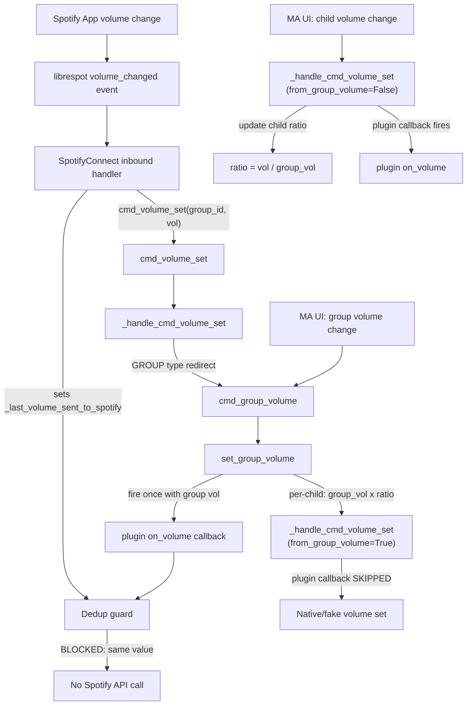

# Ratio-Based Group Volume with Upstream Isolation

## Problem Summary

Two bugs in the group volume architecture:

1. **Ratio drift**: The additive-delta algorithm with clamping permanently corrupts the relative balance between child players whenever any child hits the 0 or 100 boundary. There is no memory of intended ratios.
2. **Spotify Connect feedback loop**: When Spotify Connect is the active source on a group, every group volume change fires per-child `on_volume` callbacks to Spotify's API, sending conflicting values. Spotify picks one, fires a `volume_changed` event back, and the cycle repeats until rate-limited (HTTP 429).

## Files to Modify

### 1. `[music_assistant/constants.py](music_assistant/constants.py)` (line ~987)

Add two new constants after the existing `ATTR_`* block:

```python
ATTR_GROUP_VOLUME_LEVEL: Final[str] = "group_volume_level"
ATTR_GROUP_CHILD_RATIOS: Final[str] = "group_child_ratios"
```

### 2. `[music_assistant/controllers/players/controller.py](music_assistant/controllers/players/controller.py)`

This is the main file with five changes:

**a) Rewrite `set_group_volume` (line 1695)**

Replace the additive-delta algorithm with a ratio-based implementation:

- Store the group volume in `group_player.extra_data[ATTR_GROUP_VOLUME_LEVEL]`
- Compute each child's target as `round(group_volume * ratio)`, clamping the output only
- Pass `from_group_volume=True` to `_handle_cmd_volume_set` for each child
- Fire the plugin source callback **once** with the group volume value (not per-child)

Add a helper `_initialize_group_ratios` that first checks for persisted values in player config (for static groups), and falls back to deriving initial ratios from current child volumes, using `max(child_volumes)` as the initial group volume so no child starts clamped and all ratios begin at or below 1.0.

**b) Hook ratio initialization into `ATTR_GROUP_MEMBERS` changes (line 1527)**

In `signal_player_state_update`, the existing `ATTR_GROUP_MEMBERS in changed_values` block (line 1527) is the single convergence point where all group membership changes become visible -- static groups, dynamic sync groups, and protocol-linked groups all flow through here.

Add a call to `_update_group_ratios_on_membership_change` in this block:

```python
if ATTR_GROUP_MEMBERS in changed_values:
    prev_group_members, new_group_members = changed_values[ATTR_GROUP_MEMBERS]
    self._handle_group_dsp_change(player, prev_group_members or [], new_group_members)
    self._update_group_ratios_on_membership_change(
        player, prev_group_members or [], new_group_members or []
    )
    # ... rest of existing logic ...
```

The `_update_group_ratios_on_membership_change` method handles all membership transition cases:

- **Group first formed** (prev empty, new non-empty): Call `_initialize_group_ratios` to derive the group volume level and all ratios from current child volumes.
- **Child added to existing group**: Derive the new child's ratio from its current volume and the existing stored group volume: `ratio = child_vol / group_vol`. This avoids the bug where a child at volume 30 joining a group at volume 70 would silently jump to 70 on the next group volume change.
- **Child removed from existing group**: Remove the child's ratio entry from the dict. No recalculation of the group volume level needed (it represents intent, not a derived value).
- **Group dissolved** (new empty): Clear `ATTR_GROUP_VOLUME_LEVEL` and `ATTR_GROUP_CHILD_RATIOS` from `extra_data`.

```python
def _update_group_ratios_on_membership_change(
    self,
    group_player: Player,
    prev_members: list[str],
    new_members: list[str],
) -> None:
    """Update stored group volume ratios when group membership changes."""
    if not new_members:
        # Group dissolved -- clean up stored data
        group_player.extra_data.pop(ATTR_GROUP_VOLUME_LEVEL, None)
        group_player.extra_data.pop(ATTR_GROUP_CHILD_RATIOS, None)
        return

    if not prev_members:
        # Group just formed -- full initialization from current child volumes
        self._initialize_group_ratios(group_player)
        return

    # Incremental update: add/remove individual members
    group_vol = group_player.extra_data.get(ATTR_GROUP_VOLUME_LEVEL)
    ratios = group_player.extra_data.get(ATTR_GROUP_CHILD_RATIOS, {})

    if group_vol is None:
        # Ratios not yet initialized (e.g., after restart) -- do full init
        self._initialize_group_ratios(group_player)
        return

    added = set(new_members) - set(prev_members)
    removed = set(prev_members) - set(new_members)

    for child_id in added:
        child = self.get_player(child_id)
        if child and child.state.volume_level is not None and group_vol > 0:
            ratios[child_id] = child.state.volume_level / group_vol
        else:
            ratios[child_id] = 1.0

    for child_id in removed:
        ratios.pop(child_id, None)

    group_player.extra_data[ATTR_GROUP_CHILD_RATIOS] = ratios
```

This ensures ratios are always properly populated for every group member, whether the group is static or dynamic, and regardless of when or how members are introduced.

**c) Persist ratios for static groups**

For `PlayerType.GROUP` players (universal_group, sync_group), persist the group volume level and child ratios to player config so they survive reboots without precision loss. Dynamic sync groups (ad-hoc, where a regular player is a sync leader) use `extra_data` only since the group itself is transient.

Two helper methods:

```python
def _persist_group_volume_data(self, group_player: Player) -> None:
    """Persist group volume data to config for static groups."""
    if group_player.type != PlayerType.GROUP:
        return
    group_vol = group_player.extra_data.get(ATTR_GROUP_VOLUME_LEVEL)
    ratios = group_player.extra_data.get(ATTR_GROUP_CHILD_RATIOS)
    if group_vol is not None:
        self.mass.config.set_raw_player_config_value(
            group_player.player_id, ATTR_GROUP_VOLUME_LEVEL, group_vol
        )
    if ratios is not None:
        self.mass.config.set_raw_player_config_value(
            group_player.player_id, ATTR_GROUP_CHILD_RATIOS, ratios
        )

def _load_persisted_group_volume_data(self, group_player: Player) -> bool:
    """Load persisted group volume data from config. Returns True if found."""
    if group_player.type != PlayerType.GROUP:
        return False
    group_vol = self.mass.config.get_raw_player_config_value(
        group_player.player_id, ATTR_GROUP_VOLUME_LEVEL
    )
    ratios = self.mass.config.get_raw_player_config_value(
        group_player.player_id, ATTR_GROUP_CHILD_RATIOS
    )
    if group_vol is not None and ratios is not None:
        group_player.extra_data[ATTR_GROUP_VOLUME_LEVEL] = int(group_vol)
        group_player.extra_data[ATTR_GROUP_CHILD_RATIOS] = ratios
        return True
    return False
```

The config system's `save()` method already debounces disk writes with a 5-second delay (`DEFAULT_SAVE_DELAY` at [config.py line 123](music_assistant/controllers/config.py)), so rapid slider drags coalesce into a single write. In-memory config is updated immediately.

Call `_persist_group_volume_data` from:

- `set_group_volume` -- after storing the new group volume level
- The ratio update path in `_handle_cmd_volume_set` -- after updating a child's ratio
- `_update_group_ratios_on_membership_change` -- after adding/removing members

Call `_load_persisted_group_volume_data` from:

- `_initialize_group_ratios` -- as the first step, before deriving from current child volumes

**d) Add `from_group_volume` parameter to `_handle_cmd_volume_set` (line 2770)**

```python
async def _handle_cmd_volume_set(
    self,
    player_id: str,
    volume_level: int,
    from_group_volume: bool = False,
) -> None:
```

When `from_group_volume=True`, skip the plugin source callback at lines 2802-2805. This prevents per-child Spotify API calls during group volume changes, breaking the feedback loop.

All existing callers pass no value (default `False`), preserving current behavior for:

- Direct user volume changes via `cmd_volume_set`
- Announcement volume adjustments (lines 2066, 2100)
- Fake mute volume changes (lines 784, 790)

**e) Update ratio on individual child volume changes**

After the volume is applied in `_handle_cmd_volume_set` (and `from_group_volume` is False), check if the player belongs to any group and update its ratio:

```python
if not from_group_volume:
    for group_player in self._get_player_groups(player, powered_only=True):
        group_vol = group_player.extra_data.get(ATTR_GROUP_VOLUME_LEVEL)
        ratios = group_player.extra_data.get(ATTR_GROUP_CHILD_RATIOS, {})
        if group_vol is not None and group_vol > 0:
            ratios[player.player_id] = volume_level / group_vol
            group_player.extra_data[ATTR_GROUP_CHILD_RATIOS] = ratios
```

This is the **only** code path that modifies a child's ratio. Division by zero is avoided by the `group_vol > 0` guard; when the group volume is 0, ratios stay unchanged.

### 3. `[music_assistant/models/player.py](music_assistant/models/player.py)` (line 802)

Modify the `group_volume` cached property to prefer the stored group volume level:

```python
stored = self.extra_data.get(ATTR_GROUP_VOLUME_LEVEL)
if stored is not None:
    return stored
```

Insert this check before the average-based fallback. The fallback is retained for backwards compatibility and uninitialized groups (e.g., after restart before the first group volume change).

### 4. `[music_assistant/providers/spotify_connect/__init__.py](music_assistant/providers/spotify_connect/__init__.py)`

**No changes required.** The existing dedup guard at line 504 (`if self._last_volume_sent_to_spotify == volume`) is sufficient because:

- On inbound Spotify events (line 847), `_last_volume_sent_to_spotify` is set **before** `cmd_volume_set` is called
- The new `set_group_volume` fires the plugin callback once with the group volume value (same value Spotify sent)
- The guard blocks the echo, breaking the loop

## Key Design Decisions

**Why `max(child_volumes)` for initial group volume, not average?**
Using the max ensures all initial ratios are <= 1.0, which avoids immediate clamping artifacts. Using the average would place some ratios above 1.0 from the start.

**Two-tier storage: `extra_data` (runtime) + player config (persistent)**
`extra_data` is the hot path -- read on every volume change, updated in-place, zero I/O. For static groups (`PlayerType.GROUP`), changes are also written to player config via `set_raw_player_config_value`, which persists to `settings.json` with a 5-second debounce. On restart, `_initialize_group_ratios` restores from config before falling back to deriving from current child volumes.

For dynamic sync groups, `extra_data` alone is used. The group is transient, so persistence isn't meaningful -- ratios are re-derived from current state when the group re-forms.

**Why not suppress plugin callbacks for individual child changes too?**
The proposal in section 5.3.5 notes this is "arguably incorrect for Spotify" but acceptable for the initial fix. A child player's plugin source lookup may or may not find the Spotify source depending on whether `in_use_by` points to the group or child. This can be addressed in a follow-up.

## Edge Cases Handled

- **Group volume at zero**: `0 * ratio = 0` for all children; ratios preserved, restored when group volume rises
- **Ratio > 1.0**: Valid when child is set above group volume; output clamps to 100 but ratio persists
- **Child joins group**: Ratio derived immediately from `child_vol / group_vol` via `ATTR_GROUP_MEMBERS` change hook -- no silent volume jumps on the next group volume change
- **Child leaves group**: Ratio entry removed from dict via `ATTR_GROUP_MEMBERS` change hook
- **Group formed**: Full initialization from current child volumes, triggered by `ATTR_GROUP_MEMBERS` going from empty to non-empty
- **Group dissolved**: Stored group volume level and ratios cleaned up, triggered by `ATTR_GROUP_MEMBERS` going to empty
- **Cold start / restart (static groups)**: `_initialize_group_ratios` restores persisted ratios and group volume from player config -- no precision loss
- **Cold start / restart (dynamic groups)**: `extra_data` is not persisted, so `_initialize_group_ratios` derives ratios from current child volumes when the group re-forms

## Tests

New file: `[tests/core/test_group_volume.py](tests/core/test_group_volume.py)`

There are currently no tests for group volume logic. This file covers the ratio-based algorithm, plugin source isolation, membership initialization, and persistence.

### Test infrastructure

Follow the existing pattern from [tests/core/test_player_controller.py](tests/core/test_player_controller.py) and [tests/common.py](tests/common.py):

- `mock_mass` fixture: `MagicMock` with `config`, `signal_event`, `get_providers`
- `MockProvider` and `MockPlayer` from `tests/common.py`
- Set `controller._players`, `controller._player_throttlers`, `mock_mass.players`
- Set `_attr_volume_level` on each player (not set by default in `MockPlayer`)
- Call `update_state(signal_event=False)` after attribute setup

`MockPlayer` has `PlayerFeature.VOLUME_SET` but no `volume_set` implementation. For these tests, mock `_handle_cmd_volume_set` on the controller to capture per-child volume calls without hitting the real implementation (which involves native volume, plugin sources, etc.):

```python
volume_calls: list[tuple[str, int, bool]] = []

async def mock_handle_volume(player_id, volume_level, from_group_volume=False):
    player = controller.get_player(player_id)
    if player:
        player._attr_volume_level = volume_level
        player._cache.clear()
    volume_calls.append((player_id, volume_level, from_group_volume))

controller._handle_cmd_volume_set = mock_handle_volume
```

For plugin source isolation tests, use the real `_handle_cmd_volume_set` but mock `_get_active_plugin_source` to return a mock plugin source with an `on_volume` callback that records calls.

### Test classes and cases

`**TestRatioBasedGroupVolume**` -- core algorithm correctness

- `test_set_group_volume_applies_ratios`: Set A=80, B=40, initialize group. Set group to 60. Verify A and B adjust proportionally via `group_vol * ratio`.
- `test_ratio_preserved_through_clamping`: Set A=80, B=40. Raise group until A clamps at 100. Lower group back to original. Verify A=80, B=40 (original balance restored).
- `test_round_trip_preserves_balance`: Set A=90, B=30. Move group up by 20, down by 20. Verify A=90, B=30.
- `test_group_volume_stored_not_derived`: After `set_group_volume(70)`, verify `group_player.extra_data[ATTR_GROUP_VOLUME_LEVEL] == 70` and `group_player.state.group_volume == 70` (not the average of children).
- `test_group_volume_property_returns_stored`: Set stored group volume in `extra_data`. Verify `group_volume` property returns it, not the child average.

`**TestIndividualChildVolume**` -- ratio updates on direct child changes

- `test_individual_volume_updates_ratio`: Group at volume 70. Set child B from 35 (ratio 0.5) to 56 (new ratio 0.8). Set group to 50. Verify B = 40 (0.8 * 50).
- `test_ratio_update_skipped_when_from_group_volume`: Verify that `from_group_volume=True` does not update child ratios.
- `test_ratio_not_updated_when_group_vol_zero`: Group volume at 0. Set child volume directly. Verify ratio is unchanged (no division by zero).

`**TestPluginSourceIsolation`** -- feedback loop prevention

- `test_group_volume_skips_per_child_plugin_callback`: Mock `_get_active_plugin_source` to return a plugin source on each child. Call `set_group_volume`. Verify `on_volume` is called zero times per-child (the `from_group_volume=True` flag suppresses it).
- `test_group_volume_fires_single_plugin_callback`: Mock `_get_active_plugin_source` on the group player. Call `set_group_volume(70)`. Verify `on_volume` is called exactly once with value 70.
- `test_direct_child_volume_fires_plugin_callback`: Call `_handle_cmd_volume_set` on a child (not from group). Verify `on_volume` fires normally.

`**TestMembershipInitialization`** -- ratio initialization on group changes

- `test_group_formed_initializes_ratios`: Create players with A=80, B=40. Simulate `ATTR_GROUP_MEMBERS` change from `[]` to `["leader", "a", "b"]`. Verify `ATTR_GROUP_VOLUME_LEVEL == 80` (max) and ratios are `{"a": 1.0, "b": 0.5}`.
- `test_child_added_derives_ratio`: Existing group at volume 70, ratios initialized. Add child C at volume 35. Verify C's ratio = 0.5 (35/70).
- `test_child_removed_cleans_ratio`: Existing group with A, B ratios. Remove B. Verify B's ratio entry is gone, A's unchanged.
- `test_group_dissolved_clears_data`: Simulate members going to `[]`. Verify `ATTR_GROUP_VOLUME_LEVEL` and `ATTR_GROUP_CHILD_RATIOS` are removed from `extra_data`.
- `test_uninitialized_group_triggers_full_init`: Set `ATTR_GROUP_VOLUME_LEVEL` to None. Add a member. Verify full `_initialize_group_ratios` runs (not incremental update).

`**TestStaticGroupPersistence`** -- config persistence for `PlayerType.GROUP`

- `test_persist_writes_to_config`: Create a `PlayerType.GROUP` player. Call `_persist_group_volume_data`. Verify `set_raw_player_config_value` called with correct keys and values.
- `test_persist_skipped_for_dynamic_groups`: Create a regular player (sync leader). Call `_persist_group_volume_data`. Verify `set_raw_player_config_value` not called.
- `test_load_restores_from_config`: Mock `get_raw_player_config_value` to return stored values. Call `_load_persisted_group_volume_data`. Verify `extra_data` populated correctly.
- `test_initialize_prefers_persisted_over_derived`: Mock config to return stored ratios. Call `_initialize_group_ratios`. Verify stored values used (not derived from child volumes).

`**TestEdgeCases`**

- `test_group_volume_zero_zeros_all_children`: Set group to 0. Verify all children set to 0. Raise group to 50. Verify children restore proportional values.
- `test_ratio_above_one`: Group at 40. Set child to 60 (ratio 1.5). Raise group to 80. Verify child clamps to 100. Lower group to 60. Verify child = 90 (60 * 1.5).
- `test_no_volume_capable_children`: All children have `PLAYER_CONTROL_NONE`. Call `set_group_volume`. Verify no errors, no calls.
- `test_all_children_powered_off`: No powered children. Verify `_initialize_group_ratios` handles gracefully.

## Data Flow (After Fix)


