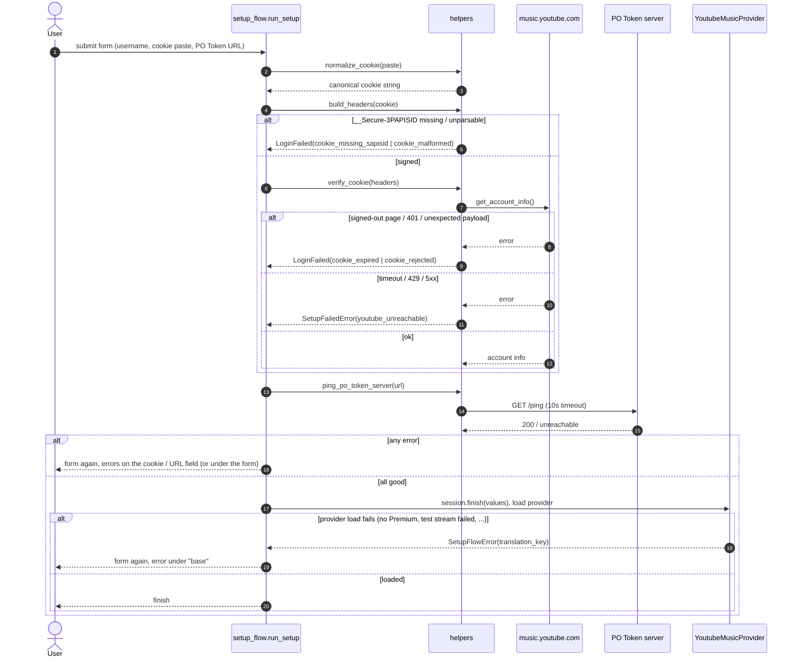
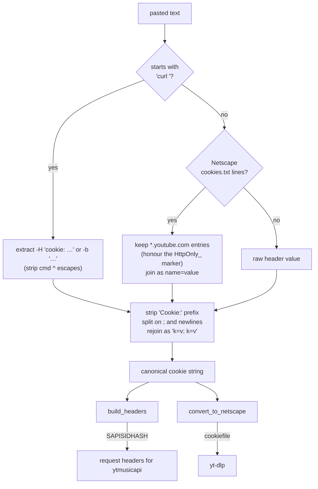
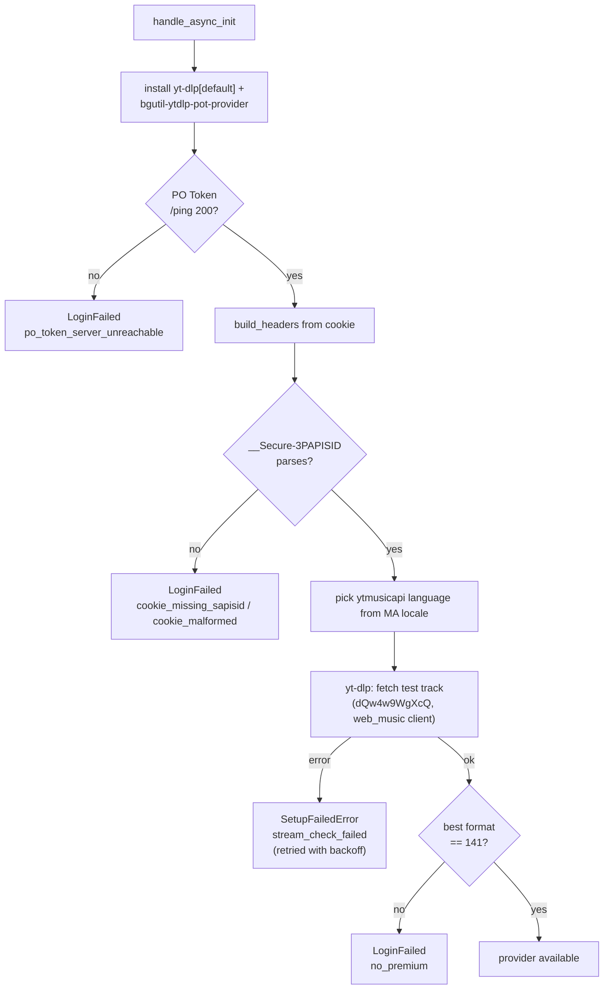
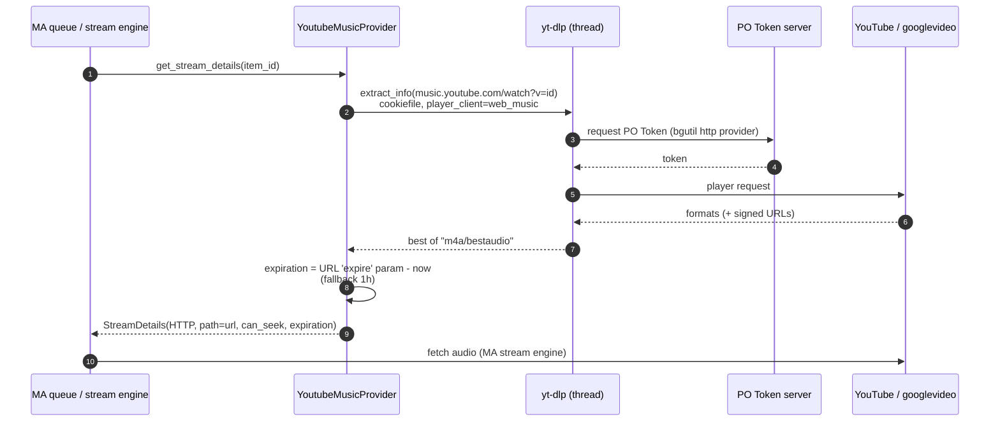

# YouTube Music Provider

The YouTube Music provider brings a user's YouTube Music library, search, recommendations and
podcasts into Music Assistant and streams tracks to Music Assistant players. It is an
**unofficial** integration: there is no partner API behind it. Metadata comes from the same
InnerTube endpoints the music.youtube.com web client uses (through
[ytmusicapi](https://github.com/sigma67/ytmusicapi)), and audio is resolved with
[yt-dlp](https://github.com/yt-dlp/yt-dlp) plus a
[PO Token](https://github.com/yt-dlp/yt-dlp/wiki/PO-Token-Guide) provider.

Two things follow from that and shape everything below:

- The only login the web client accepts from an unofficial client is a **browser session
  cookie**. Google blocked the device-code OAuth flow this provider once used (#1777) and
  yt-dlp dropped OAuth entirely, so there is no "Sign in with Google" to offer.
- Google changes the web client often. `yt-dlp` and `bgutil-ytdlp-pot-provider` are therefore
  installed at provider load rather than pinned in the manifest, and a **PO Token server**
  (the *YT Music PO Token Generator* add-on) must be reachable for streams to resolve.

A **paid YouTube Music Premium** subscription is required; the provider refuses to load
without one.

## Module layout

```
ytmusic/
├── __init__.py      YoutubeMusicProvider: MA-facing provider (library, search, streams, recs)
├── setup_flow.py    Setup: collect + normalize + verify the cookie and PO Token server
├── helpers.py       ytmusicapi call wrappers, cookie handling, PO Token ping
├── constants.py     Domains, cookie auth field, translation owner, recommendation icons
├── strings.json     Config labels and the provider's localized error messages
└── manifest.json    Domain, features, pinned ytmusicapi dependency
```

## Setup flow

`setup_flow.run_setup` shows a single form (username, cookie, PO Token server URL) and
**validates before it saves**. Each check reports on its own field, and both run
independently so a user sees every problem in one round. Only when both pass is the provider
instance created and loaded.



Every failure the flow can show has its own key under `errors` in `strings.json`, resolved
under the `provider.ytmusic` owner. That matters because `LoginFailed` carries a generic
class-level `login_failed` key, which would otherwise replace the specific message with
*"Login failed. Please check your credentials"*.

| Key | Raised by | Meaning |
| --- | --- | --- |
| `cookie_missing_sapisid` | `helpers.build_headers` | No `__Secure-3PAPISID` field: the cookie was copied from a request that was not signed in. |
| `cookie_malformed` | `helpers.build_headers` | `SimpleCookie` could not parse it (a stray space inside a value is enough). |
| `cookie_expired` | `helpers._raise_if_signed_out` | YouTube answered with its signed-out page: the session was rotated or logged out. |
| `cookie_rejected` | `helpers.verify_cookie` | YouTube answered 401/403, or with something other than the account page (consent or sign-in interstitial); the cause is in the log. |
| `youtube_unreachable` | `helpers.verify_cookie` | Timeout, connection failure, 429 or 5xx while verifying: shown under the form, not on the cookie field (raised as `SetupFailedError`). |
| `po_token_server_unreachable` | flow / `handle_async_init` | `GET <url>/ping` did not answer 200. |
| `no_premium` | `handle_async_init` | The test track did not offer the Premium-only HQ format. |
| `stream_check_failed` | `_user_has_ytm_premium` | yt-dlp could not fetch the test track at all (raised as a retryable `SetupFailedError`). |

Setup failures are also logged at WARNING by the config controller
(`_finish_provider_setup`), because the rolled-back instance leaves no other trace.

## Cookie handling

Users get the cookie from wherever is easiest for them, so `helpers.normalize_cookie` accepts
several shapes and stores one canonical form.



The same cookie feeds two consumers:

- **ytmusicapi** gets HTTP headers from `build_headers`: the raw `Cookie` plus an
  `Authorization: SAPISIDHASH …` derived from `__Secure-3PAPISID`, which is why that field
  is mandatory.
- **yt-dlp** needs a Netscape cookie file; `convert_to_netscape` rewrites the string as one,
  pinned to the `.youtube.com` domain.

A brand account is selected by entering its 21-digit ID as the username
(`helpers.is_brand_account`); any other username value is ignored. ytmusicapi sends the ID as
`context.user.onBehalfOfUser` in every request.

## Provider load

`handle_async_init` runs on every (re)load — at startup, after setup and on each retry.



The distinction between the two error types is deliberate. `mass.load_provider` retries any
`MusicAssistantError` with backoff **except** auth errors (`LoginFailed` & co.), which flag the
provider as needing reconfiguration. A PO Token server that answers `/ping` before it can
mint tokens, or a transient "confirm you're not a bot" from YouTube, must therefore surface as
a retryable `SetupFailedError`, not as a login problem.

Once loaded, a `LoginFailed` raised during a library sync (YouTube answering with its
signed-out page) unloads the provider with that error, so the user is sent back to
reconfigure instead of every sync failing the same way.

## Streaming

Playback is the sensitive path. The provider hands Music Assistant a `StreamDetails` with a
googlevideo URL that MA's own stream engine fetches and transcodes; the URL is never exposed
to clients.



- `max_concurrent_streams` is 3: a few parallel fetches are allowed and YouTube is left to
  enforce the account's own allowance.
- Podcast episode IDs are `podcast_id|episode_id` (`PODCAST_EPISODE_SPLITTER`); only the
  episode part is resolved.
- The same yt-dlp extraction is what the Premium check uses at load time.

## Library, search and recommendations

All ytmusicapi calls are wrapped by `helpers._run_ytmusic`, which runs the blocking client in
a thread and translates YouTube's signed-out page into `LoginFailed(cookie_expired)`.

Personal playlist IDs (Liked songs `LM`, SuperMix, My Mix 1–7, Discover, …) are not unique
across accounts, so library playlist IDs are stored as `<playlist_id>🎵<instance_id>`
(`YT_PLAYLIST_ID_DELIMITER`); dynamic mixes are capped at `DYNAMIC_PLAYLIST_TRACK_LIMIT`
tracks. "Episodes for later" and "New episodes" (`YT_PERSONAL_PODCAST_PLAYLISTS`) are
skipped in the playlist sync and surfaced through the podcast library instead.

Search is pinned to English so results are stable regardless of the MA locale; other calls use
the closest ytmusicapi-supported language to the MA locale.

Responses are cached through `@use_cache` to keep the request rate down:

| Call | TTL | Notes |
| --- | --- | --- |
| `search` | 7 days | checksum `english_search_v1` invalidates pre-pinning entries |
| `get_album`, `get_artist`, `get_track` | 30 days | |
| `get_album_tracks` | 30 days | stale-while-revalidate |
| `get_playlist` | 7 days | |
| `get_playlist_tracks` | 3 hours | stale-while-revalidate |
| `get_artist_albums`, `get_artist_toptracks` | 7 days | stale-while-revalidate |
| `get_similar_tracks`, *Mixed for you* folder | 1 day | stale-while-revalidate |

Recommendations come from the YouTube Music home page (`get_home`), rendered as
`RecommendationFolder`s with an icon chosen from the row title
(`determine_recommendation_icon`), plus a synthesized *Mixed for you* folder of the personal
mixes.

## Troubleshooting

| Symptom | Likely cause | What to do |
| --- | --- | --- |
| *cookie is missing `__Secure-3PAPISID`* | Copied from a request made before signing in, or from another host. | In the incognito window open your Library first, then copy the `Cookie` header of a `/browse` request — or export `cookies.txt` with a cookie exporter extension and paste that. |
| *could not be parsed* | The paste was edited or wrapped oddly. | Paste exactly what the browser/exporter produced. |
| *session is no longer valid* | Google rotated the session (normal tab kept open, logged out, incognito window closed). | Export a fresh cookie; the cookies.txt route from an incognito window lasts longest. |
| *PO Token server is not reachable* | The *YT Music PO Token Generator* add-on is not installed/running, or the URL is wrong. | Install/start it; check the URL (default `http://127.0.0.1:4416`). |
| *Premium was not detected* | The account has no active YouTube Music Premium, or the cookie belongs to a different account. | Check the subscription; sign in with the right account before copying. |
| *could not fetch a test stream* | yt-dlp failed: PO Token server not minting yet, YouTube rate limiting, or a yt-dlp update needed. | During setup, submit the form again once the PO Token server is up; an already configured provider retries on its own at startup. The yt-dlp error is in `musicassistant.log`. |
| *could not be reached to verify the cookie* | YouTube timed out, rate limited (429) or answered 5xx while the cookie was being checked. | Nothing is wrong with the form values; try again in a moment. |

Setup failures are logged at WARNING even though the instance is rolled back; look for
`Setup of ytmusic failed:` in `musicassistant.log`.

## Tests

`tests/providers/ytmusic/`:

- `test_cookie.py` — every accepted paste format, header signing, missing/unparsable cookie.
- `test_setup_flow.py` — drives the real `run_setup` through a `SetupSession` with the
  network calls patched: normalization before finish, per-field errors, refused cookie,
  finish failure and retry.
- `test_helpers.py` — signed-out translation in the ytmusicapi wrapper and `verify_cookie`.
- `test_ytmusic.py` — PO Token ping, Premium check, sync unload on invalid session, parsers.
- `test_album_tracks.py`, `test_podcast_parsing.py`, `test_recommendations.py` — parsing.

None of them talk to YouTube; the `get_account_info` verification and the yt-dlp extraction
can only be exercised against a real Premium account.
